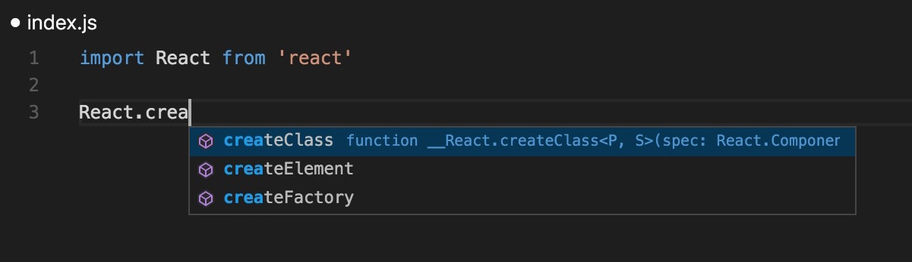

# vs-react-intellisense
A blank project to get Intellisense for React in Visual Studio Code



## Guide

```
git clone https://github.com/didierfranc/vs-react-intellisense.git
npm install
```

That's it start editing `index.js`

